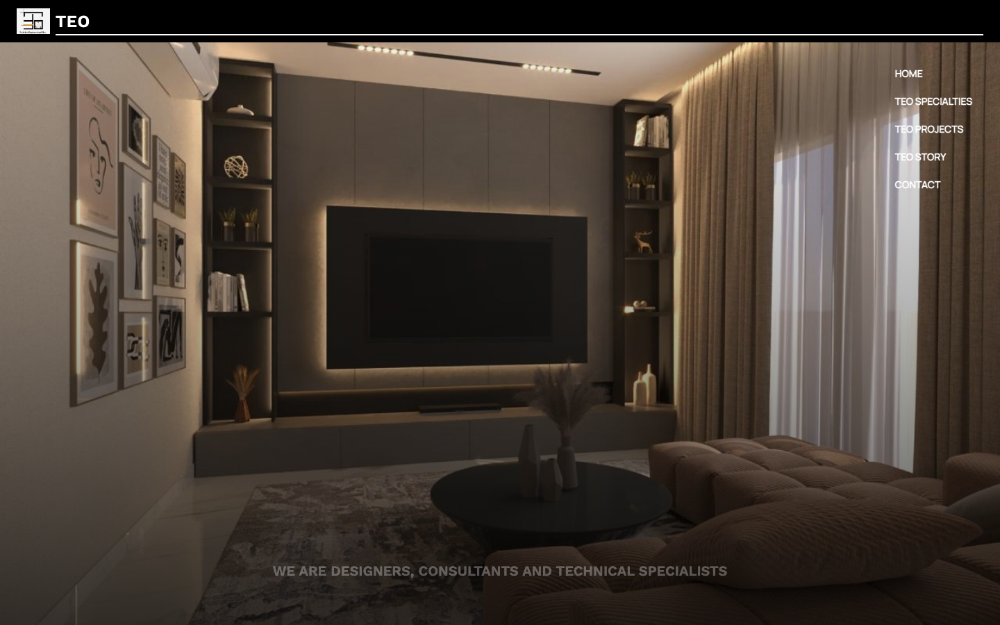

# TEO Architecture Portfolio

A responsive portfolio website for TEO Architecture, built to present the studio's services, design story, specialties, completed work, and consultation channel. The application uses React Router for dedicated pages and a media-rich project gallery for architectural images and video.

[View the source](https://github.com/mohamedmosilhy/TEO) | [View the live demo](https://mohamedmosilhy.github.io/TEO/)



## Routes

| Route              | Purpose                                            |
| ------------------ | -------------------------------------------------- |
| `/`                | Hero, architecture services, and consultation form |
| `/projects`        | Filterable project portfolio                       |
| `/teo-specialties` | Studio approach and specialist capabilities        |
| `/story`           | TEO background and design philosophy               |

Unknown routes redirect to the homepage.

## Features

- Full-screen rotating hero imagery
- Responsive navigation and shared footer
- Interior, exterior, fitting-out, and renovation services
- Project filtering by category and by Design or Real work
- Grid and list display modes
- Project count feedback
- Rich media viewer supporting images and videos
- Previous/next navigation, thumbnails, zoom, playback controls, and auto-advance
- Lazy-loaded route pages with loading fallbacks
- Google Forms consultation submission
- Error boundary for a recoverable application-level failure screen
- Instagram, WhatsApp, email, and telephone contact links

## Architecture

- `App.jsx` defines the shared layout and route tree.
- `pages/` contains route-level wrappers.
- `components/projects/` owns filters, cards, and the media modal.
- `useProjects` manages filter, view, selection, and modal state.
- `projectsData.js` imports local project media and builds the portfolio records.
- Large route components are loaded with `React.lazy` and `Suspense`.

## Built with

- React 19
- React Router 7
- Vite 7 with the SWC React plugin
- Tailwind CSS 4
- GSAP
- Lucide React and React Icons
- ESLint

## Getting started

### Prerequisites

- Node.js
- npm

### Installation

```bash
git clone https://github.com/mohamedmosilhy/TEO.git
cd TEO
npm install
npm run dev
```

The Vite development server is configured to open at `http://localhost:3000`.

### Available scripts

| Command                 | Purpose                                           |
| ----------------------- | ------------------------------------------------- |
| `npm run dev`           | Start the development server on port 3000         |
| `npm run build`         | Create an optimized production build              |
| `npm run build:analyze` | Build using analyze mode                          |
| `npm run preview`       | Preview the build on port 3000                    |
| `npm run lint`          | Run ESLint                                        |
| `npm run lint:fix`      | Apply safe ESLint fixes                           |
| `npm run deploy`        | Build and publish `dist/` to GitHub Pages         |
| `npm run clean`         | Remove generated build and Vite cache directories |

## Project structure

```text
TEO/
├── public/                  # GitHub Pages support files
├── src/
│   ├── assets/             # Brand, service, story, project, and audio media
│   ├── components/
│   │   └── projects/       # Portfolio cards, filters, and viewer
│   ├── constants/
│   ├── data/
│   ├── hooks/
│   ├── pages/
│   ├── App.jsx
│   └── main.jsx
├── vite.config.js
└── package.json
```

## Deployment note

The current Vite base is `/` and `BrowserRouter` has no `basename`. For a repository-subpath GitHub Pages deployment, align both values with `/TEO/` before publishing, or host the generated application at a domain root with server fallback routing.
